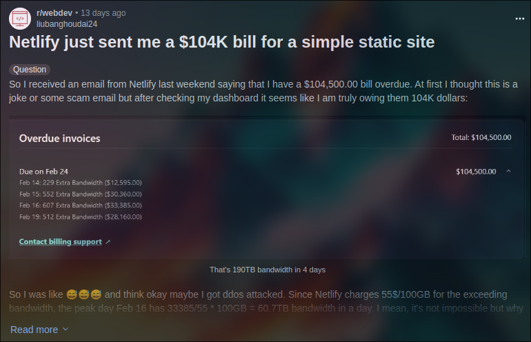
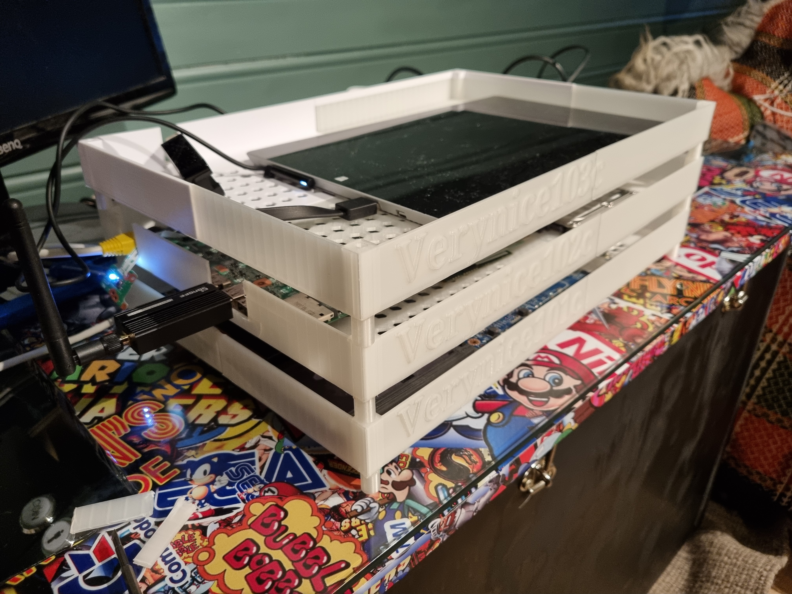

## Effektiv hjemmelab på 1-2-3 med k3s og gamle laptoper 🚀

Karl Solgård

12.03.2024

---

## Kubernetes på gamle laptoper fra 2013?

Galskap? 

---

## Redusere e-søppel ♻️

Mulig at det man vurderer å kjøpe er allerede tilgjengelig hjemme?

note: if you're like me, you probably have a few units of computing lying around at home. If you're planning to build a home lab, these computers might be sufficient to host the workloads that you desire without buying new hardware.

---

## Sky kan være dyrt 🌩️

note: the cloud is a remarkable technology in it's own right. Its easy to set up and you don't need to maintain the physical machines running your software. When using the cloud, you will use computing power and compute isn't cheap. Cloud costs can also bite you when "pay as you go" plans can rack up the bills when unexpected spikes in traffic occur.

---



---

## Tenk på miljøet 🍀

note: When refurbishing old computers instead of buying new ones, you prevent increasing the demand for computer chips in the world. When utilizing the cloud you take up compute resources that need to be supplied. This will in turn also affect how datacenters purchases new machines and new chips will be required. 

---

## Fra laptop til server 💻️

note: A home lab can come in many different variations and sizes. The simplest home labs run on consumer grade machines that you already use, and the most advanced ones are comparable to enterprise grade server setups. It's really what you make it to be. If you're like me, you probably have some old hardware dusting away in your home. In my case, I found 3 old laptops from my student years and early career. They pack the same punch as many modern single board computers and I think it's a shame that these computers go un-utilized. Let's put them to use and make ourselves a home lab! 

---

### Spekks ⚙️

| Modell        | Minne           | CPU  | Disk  |
|---------------|:---------------:|:----:|------:|
| Dell Latitude E6540     | 8 GB DDR3L 1600 MHz | Intel i7-4800MQ (8) @ 3.700GHz | 128 GB SSD |
| HP Pavillion 15         | 4 GB DDR3L 1600 MHz | AMD A8-6410 APU (4) @ 2.000GHz | 1TB HDD    |
| Microsoft Surface Pro 3 | 4 GB DDR3L 1600 MHz | Intel i5-4300U (4) @ 2.900GHz  | 128 GB SSD | 

---


---



---

## BIOS

- Wake on AC
- Batteri maks 80%

note: Before setting up the machines it's a good idea to update the BIOS. This is generally easier to do on windows as it is better supported. We want to be able to boot the machines up as soon as they start to draw power. Many BIOS allow this with the setting, "Wake on AC". If you have healthy batteries you can use them as a reserve power supply in case of power outages. Make sure to set a maximum of 80% in the BIOS for better battery health and longevity. 

---

## OS: Ubuntu Server 22.04🐧

- Deaktivere "lokket"
- Skru av skjermen 🌛
- Aktivere Ethernet dongle 

---

## Redusere strømbruk 🕯️

Installerer en tjeneste som heter TLP

```bash
$ apt-get update -y
$ apt-get install -y tlp

$ systemctl enable tlp.service
$ systemctl start tlp.service

$ bluetooth off
$ wifi off
```

note: By peeling away the screen and the case you can reduce some of the power drawn in terms of keeping the thermals down. Remove devices like wifi and bluetooth if they're not integrated. If removing the components physically is impossible or hard, it's easy to disable these using a package called TLP. This is a service designed to reduce power consumptions on laptops. It's based on Intel's Powertop which is a diagnostic tool to analyze the power consumption on a laptop and in turn uses the Intel’s Running Average Power Limit (RAPL) to measure. The TLP service will configure a series of recommended steps to reduce power draw and will run in the background to keep the power consumption down.

---

## Installere k3s

---

## Installere k3s

```sh
$ curl -sfL https://get.k3s.io | sh - 
```

note: This takes about 30 seconds to run and will set up your machine as a k3s node! This command is also configurable to suit your needs. We're going to install one server node and two worker nodes. We will disable traefik and servicelb and replace them with cloudflared and metallb.ccb

---

## Tilpass med å deaktivere tjenester man ikke trenger

```sh
$ bash /usr/local/bin/k3s-uninstall.sh

$ curl -sfL https://get.k3s.io | sh - 
  \ --disable servicelb
  \ --disable traefik
```

---

## Installere på arbeidsnoder

```sh
$ curl -sfL https://get.k3s.io | 
  \ K3S_URL=https://ip-address-of-server:6443 
  \ K3S_TOKEN=mynodetoken sh -
  \ --disable servicelb
  \ --disable traefik
```

---

## Da er vi klare for å installere applikasjoner 🙌

---

## Interne tjenester
- AdGuard Home
- Prometheus med eksportører for:
  - Speedtest (internethastighet)
  - Blackbox (Oppetid)
  - Kepler (Strømbruk)
- Grafana

---

## Tjenester på nett
- Personlig blogg
- Home Assistant
- Harbor Container Registry

---

## GitOps med Flux

```bash
$ flux bootstrap github 
  \ --owner=MyUser 
  \ --repository=my-cluster-repo 
  \ --path=path/to/cluster/env 
  \ --personal
```

note: Before we start looking at the separate applications, we need to look at how we want to manage them. One way to do this is to store all the manifests to a git repository and use flux to link the repository to the cluster. This helps us declare manifests and helm packages in yaml and automatically link the manifests to a cluster with a few commands. Install flux and link your git-repository containing manifests to your cluster using flux with the following command.

---

## Ut på nett med Cloudflare Tunnels

```bash
$ cloudflared tunnel create example-tunnel

$ kubectl create secret generic tunnel-credentials \
--from-file=credentials.json=/.cloudflared/ef824aef-7557-4b41-a398-4684585177ad.json
```

note: We're going to use Cloudflare tunnels to tunnel services to the DNS and ultimately the internet. This is a way to tunnel applications to the internet without opening any ports on the your local network. Provided that you have created a Cloudflare account and `cloudflared` cli installed, setting up a tunnel is suprisingly easy.