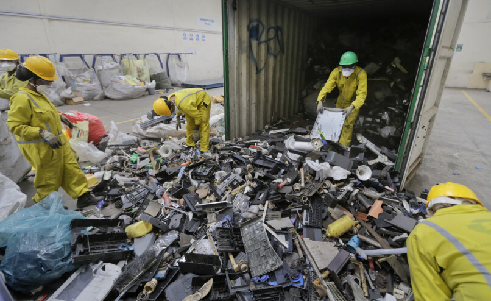
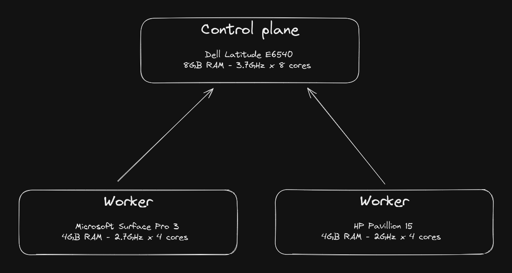
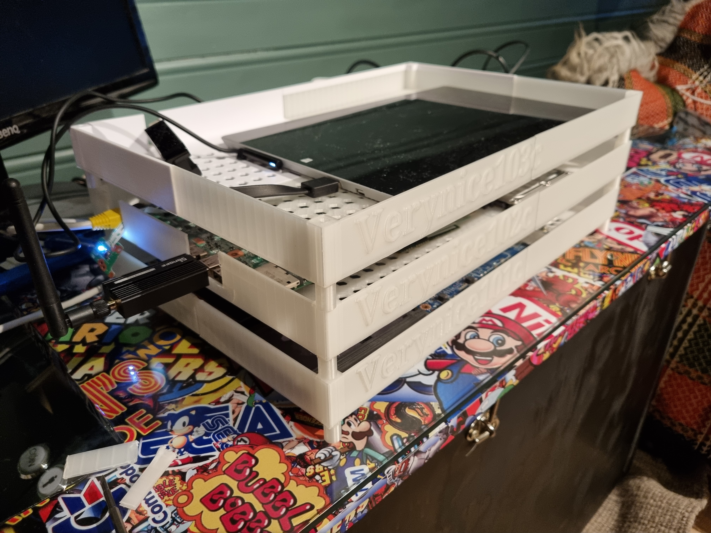
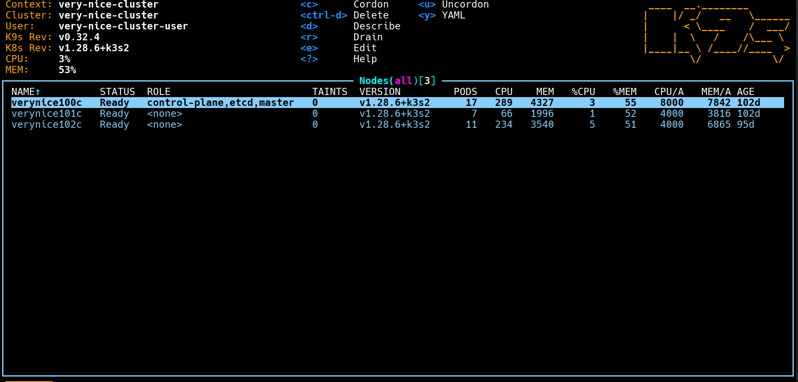

### Building a Home Server Using Kubernetes on Old Laptops: A Sustainable Approach to Minimizing E-Waste 🚀

Karl Solgård, NOVACARE AS

12.06.2024 @ NDC

note: Hello! My name is Karl Solgård. I'm a senior consultant at NOVACARE during the day and I like to make stuff during the night. And one of the things that I have made is a kubernetes cluster at home using old e-waste around the house. 

---

## E-Waste is a big environmental challenge



note: E-waste is a big environmental challenge. A total of 154 000 tons of e-waste was collected in Norway during 2022 which is about 28 kgs of e-waste per person. Still a lot of e-waste lies around in the norwegian households, dusting away. How can we turn some of this waste into something useful?

---

## Harvesting E-waste guts and make stuff!

note: A laptop has a lot of components to build stuff out of. I've seen people creating their own home surveilence systems out of webcams as an example. We will be utilizing the logic boards of old laptops and create a home lab. A home lab can come in many different variations and sizes. The simplest home labs run on consumer grade machines that you already use, and the most advanced ones are comparable to enterprise grade server setups. It's really what you make it to be. In my case, I found 3 old laptops from my student years and early career. They pack the same punch as many modern single board computers and I think it's a shame that these computers go un-utilized.

---

## How do we tie these computers together?


---

## k3s!

How many lines of code does it take to set up a k3s instance?

note: I think k3s is a good match for this kind of build. It is a lightweight, easy-to-install Kubernetes distribution designed for edge computing, IoT, and small to medium-sized clusters, emphasizing simplicity and resource efficiency.

---

## Install k3s
```bash
$ curl -sfL https://get.k3s.io | sh - 
```

note: This takes about 30 seconds to run and will set up your machine as a k3s node! This command is also configurable to suit your needs. We're going to install one server node and two worker nodes. We will disable traefik and servicelb and replace them with cloudflared and metallb

---

## Add worker nodes

```bash
$ curl -sfL https://get.k3s.io | 
  \ K3S_URL=https://ip-address-of-control-plane:6443 
  \ K3S_TOKEN=mynodetoken sh -
```

---



---



---



---

## What I run on my cluster
- AdGuard Home
- Prometheus with exporters for:
  - Blackbox (Uptime)
  - Kepler (Power consumption per service)
- Grafana
- Personal blog (blog.solgard.solutions)
- Home Assistant
- Flux for GitOps

---

## Power consumption ⚡
- The cluster draws about .03 kWh
- Monthly cost of 16,5 NOK (1,52 USD) given a kWh rate of 0,767 NOK (0,07 USD)

note: Just for fun and in the spirit of comparing apples to oranges, the minimal "free" tier to an AKS cluster would be a monthly cost of 35,34 USD (1 VM, 4 GB RAM).

---

## Suprise!
Can I add my smart phone to the cluster?

---

## Perhaps?
Some approaches:
- PostmarketOS
- Docker + Termux

---

## Thank you, NDC!

- Blog post...
- Github repo...